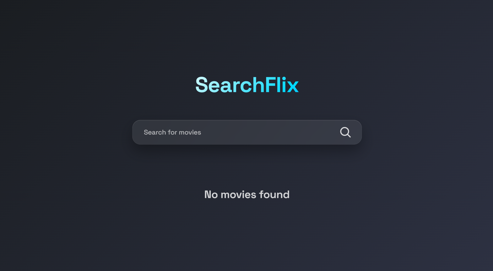

# 🎬 SearchFlix

An interactive and modern web application that allows users to search for movies by name and view detailed movie cards with key information like the title, poster, release date, and more.

Built using **React**, **JavaScript**, **HTML**, and **CSS**, this app provides a clean, responsive UI and real-time search capabilities powered by a public movie API.


---

## 🚀 Features

- 🔍 **Live Movie Search**: Search for any movie by name with instant results.
- 🃏 **Dynamic Movie Cards**: View each movie's poster, title, release year, and additional details.
- 🧼 **Clean & Responsive UI**: Styled with CSS for a modern look on all screen sizes.
- ⚡ **Fast Performance**: Built with React for efficient rendering and user interactions.

---

## 🛠️ Technologies Used

- **JavaScript** – Core logic and interactivity
- **React** – Component-based UI framework
- **CSS** – Styling and layout
- **[OMDb API](https://www.omdbapi.com/)** – For fetching movie data

---

## 📦 Installation

1. Clone the repository:
   ```bash
   git clone https://github.com/yourusername/moviefinder.git
   cd moviefinder

2. Install dependencies:
   ```bash
   npm install

3. Start the development server:
   ```bash
   npm start

## Credits
Created by Louis Nguyen
